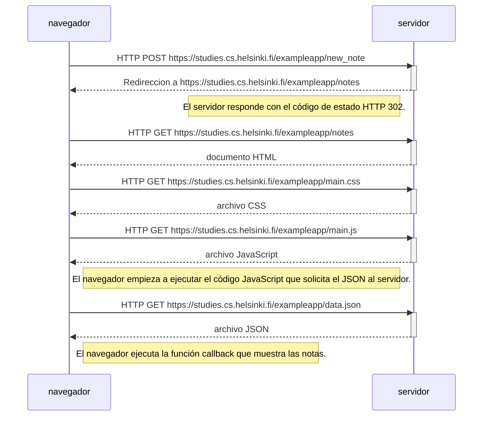

```mermaid
    sequenceDiagram
    participant navegador
    participant servidor

    navegador->>servidor: HTTP POST https://studies.cs.helsinki.fi/exampleapp/new_note
    activate servidor
    servidor-->>navegador: Redireccion a https://studies.cs.helsinki.fi/exampleapp/notes
    deactivate servidor
    Note left of servidor: El servidor responde con el código de estado HTTP 302.

    navegador->>servidor: HTTP GET https://studies.cs.helsinki.fi/exampleapp/notes
    activate servidor
    servidor-->>navegador: documento HTML
    deactivate servidor

    navegador->>servidor: HTTP GET https://studies.cs.helsinki.fi/exampleapp/main.css
    activate servidor
    servidor-->>navegador: archivo CSS
    deactivate servidor

    navegador->>servidor: HTTP GET https://studies.cs.helsinki.fi/exampleapp/main.js
    activate servidor
    servidor-->>navegador: archivo JavaScript
    deactivate servidor
    Note right of navegador: El navegador empieza a ejecutar el código JavaScript que solicita el JSON al servidor.

    navegador->>servidor: HTTP GET https://studies.cs.helsinki.fi/exampleapp/data.json
    activate servidor
    servidor-->>navegador: archivo JSON
    deactivate servidor

    Note right of navegador: El navegador ejecuta la función callback que muestra las notas.
```
