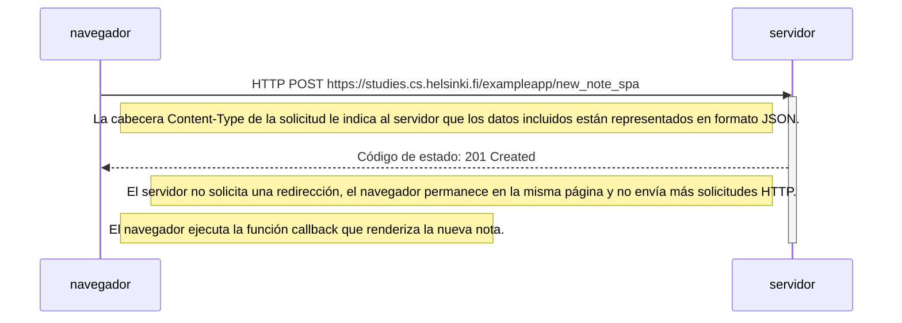

```mermaid
    sequenceDiagram
    participant navegador
    participant servidor

    navegador->>servidor: HTTP POST https://studies.cs.helsinki.fi/exampleapp/new_note_spa
    activate servidor
    Note right of navegador: La cabecera Content-Type de la solicitud le indica al servidor que los datos incluidos están representados en formato JSON.
    servidor-->>navegador: Código de estado: 201 Created
    Note left of servidor: El servidor no solicita una redirección, el navegador permanece en la misma página y no envía más solicitudes HTTP.
    Note right of navegador: El navegador ejecuta la función callback que renderiza la nueva nota.
    deactivate servidor
```
